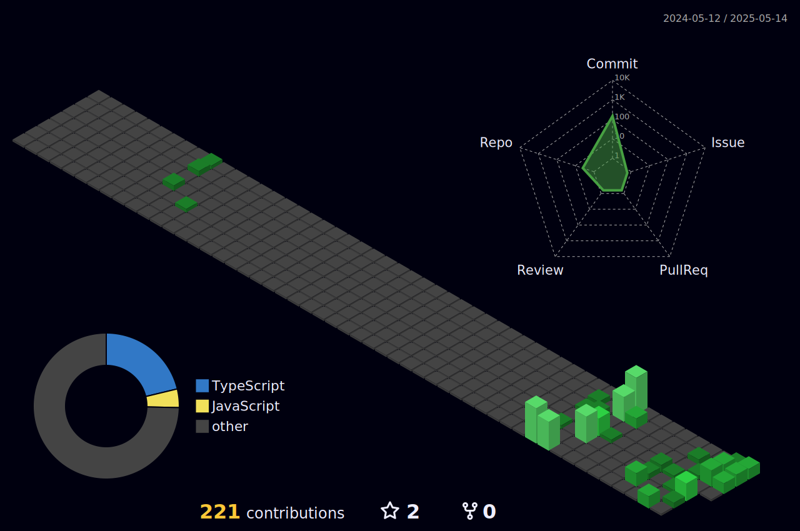

<br />
<br />

## 🏆 **Sobre mim**

🟢 Estudando e aplicando **desenvolvimento, engenharia e arquitetura de software**, com experiência em **integração de sistemas e automação de processos**.  
💻 Atuo como **Desenvolvedor Backend**, com foco em **APIs, segurança e escalabilidade de aplicações**.

📌 **Principais áreas de atuação:**  
✔ Desenvolvimento Backend (**Node.js, NestJS, Strapi, APIs REST/GraphQL**)  
✔ Arquitetura e segurança de software  
✔ Integração de sistemas e automação de processos  
✔ Otimização de performance e escalabilidade  
✔ Bancos de dados: **MySQL, MongoDB, PostgreSQL**

## 📚 **Educação e Certificações**

🎓 **Análise e Desenvolvimento de Sistemas**  
🖥️ **Pós-graduação em Arquitetura de Software - FIAP**  
📜 **Certificações relevantes (listadas no LinkedIn)**

<div align="center">
    
[](#)

</div>

<a href="#">
  
</a>

<div align="center">


</div>

<div align="center">

</div>


## 📊 **WakaTime Stats**

<!--START_SECTION:waka-->


**🐱 My GitHub Data** 

> 📦 26.7 kB Used in GitHub's Storage 
 > 
> 🏆 144 Contributions in the Year 2025
 > 
> 🚫 Not Opted to Hire
 > 
> 📜 15 Public Repositories 
 > 
> 🔑 6 Private Repositories 
 > 
**I'm a Night 🦉** 

```text
🌞 Morning                48 commits          ███░░░░░░░░░░░░░░░░░░░░░░   11.35 % 
🌆 Daytime                139 commits         ████████░░░░░░░░░░░░░░░░░   32.86 % 
🌃 Evening                213 commits         █████████████░░░░░░░░░░░░   50.35 % 
🌙 Night                  23 commits          █░░░░░░░░░░░░░░░░░░░░░░░░   05.44 % 
```
📅 **I'm Most Productive on Sunday** 

```text
Monday                   52 commits          ███░░░░░░░░░░░░░░░░░░░░░░   12.29 % 
Tuesday                  35 commits          ██░░░░░░░░░░░░░░░░░░░░░░░   08.27 % 
Wednesday                63 commits          ████░░░░░░░░░░░░░░░░░░░░░   14.89 % 
Thursday                 87 commits          █████░░░░░░░░░░░░░░░░░░░░   20.57 % 
Friday                   26 commits          ██░░░░░░░░░░░░░░░░░░░░░░░   06.15 % 
Saturday                 71 commits          ████░░░░░░░░░░░░░░░░░░░░░   16.78 % 
Sunday                   89 commits          █████░░░░░░░░░░░░░░░░░░░░   21.04 % 
```


📊 **This Week I Spent My Time On** 

```text
🕑︎ Time Zone: America/Sao_Paulo

💬 Programming Languages: 
JavaScript               25 hrs 41 mins      ████████████████████░░░░░   80.86 % 
YAML                     1 hr 18 mins        █░░░░░░░░░░░░░░░░░░░░░░░░   04.10 % 
TypeScript               1 hr 16 mins        █░░░░░░░░░░░░░░░░░░░░░░░░   04.03 % 
Image (svg)              54 mins             █░░░░░░░░░░░░░░░░░░░░░░░░   02.87 % 
Other                    46 mins             █░░░░░░░░░░░░░░░░░░░░░░░░   02.43 % 

🔥 Editors: 
VS Code                  31 hrs 28 mins      █████████████████████████   99.05 % 
Postman                  18 mins             ░░░░░░░░░░░░░░░░░░░░░░░░░   00.95 % 

🐱‍💻 Projects: 
funneler-api             25 hrs 46 mins      ████████████████████░░░░░   81.11 % 
MauricioGoulartt         2 hrs 48 mins       ██░░░░░░░░░░░░░░░░░░░░░░░   08.82 % 
nest-smartranking        1 hr 27 mins        █░░░░░░░░░░░░░░░░░░░░░░░░   04.59 % 
angelasirino-api         29 mins             ░░░░░░░░░░░░░░░░░░░░░░░░░   01.55 % 
evon-api                 18 mins             ░░░░░░░░░░░░░░░░░░░░░░░░░   00.97 % 

💻 Operating System: 
Mac                      26 hrs 57 mins      █████████████████████░░░░   84.83 % 
WSL                      4 hrs 35 mins       ████░░░░░░░░░░░░░░░░░░░░░   14.43 % 
Windows                  13 mins             ░░░░░░░░░░░░░░░░░░░░░░░░░   00.73 % 
```

**I Mostly Code in JavaScript** 

```text
JavaScript               9 repos             ████████████░░░░░░░░░░░░░   50.00 % 
TypeScript               6 repos             ████████░░░░░░░░░░░░░░░░░   33.33 % 
Shell                    1 repo              █░░░░░░░░░░░░░░░░░░░░░░░░   05.56 % 
Dart                     1 repo              █░░░░░░░░░░░░░░░░░░░░░░░░   05.56 % 
CSS                      1 repo              █░░░░░░░░░░░░░░░░░░░░░░░░   05.56 % 
```


**Timeline**


 Last Updated on 15/03/2025 18:41:03 UTC
<!--END_SECTION:waka-->

[](#)


## 🟢 **Tecnologias**

<div>
  
</div>

## 📩 **Contato**

<div>
  <a href="mailto:mauriciogoulart.1990@gmail.com"></a>
  <a href="https://www.linkedin.com/in/mauriciogoulart/" target="_blank"></a>
</div>

<p align="center">
  
</p>
