[](https://wakatime.com/badge/user/c692ec5a-960c-464a-801e-8bcf7a77eb55/project/3eed53b6-8935-48a5-9b38-667f3b0be9a4)

<br />
<br />

## 🏆 **Sobre mim**

🟢 Estudando e aplicando **desenvolvimento, engenharia e arquitetura de software**, com experiência em **integração de sistemas e automação de processos**.  
💻 Atuo como **Desenvolvedor Backend**, com foco em **APIs, segurança e escalabilidade de aplicações**.

📌 **Principais áreas de atuação:**  
✔ Desenvolvimento Backend (**Node.js, NestJS, Strapi, APIs REST/GraphQL**)  
✔ Arquitetura e segurança de software  
✔ Integração de sistemas e automação de processos  
✔ Otimização de performance e escalabilidade  
✔ Bancos de dados: **MySQL, MongoDB, PostgreSQL**

## 📚 **Educação e Certificações**

🎓 **Análise e Desenvolvimento de Sistemas**  
🖥️ **Pós-graduação em Arquitetura de Software - FIAP**  
📜 **Certificações relevantes (listadas no LinkedIn)**

## 📊 **WakaTime Stats**

<!--START_SECTION:waka-->

```txt
From: 13 April 2023 - To: 10 March 2025

Total Time: 139 hrs 26 mins

JavaScript    77 hrs 19 mins  █████████████▓░░░░░░░░░░░   54.95 %
TypeScript    45 hrs 15 mins  ████████░░░░░░░░░░░░░░░░░   32.16 %
JSON          5 hrs 44 mins   █░░░░░░░░░░░░░░░░░░░░░░░░   04.08 %
Markdown      2 hrs 38 mins   ▒░░░░░░░░░░░░░░░░░░░░░░░░   01.87 %
C#            1 hr 49 mins    ▒░░░░░░░░░░░░░░░░░░░░░░░░   01.29 %
```

<!--END_SECTION:waka-->

<div align="center">
  <a href="#">
        
        
    </a>
</div>

## 📊 **GitHub Stats**

<div align="center">
  <a href="#">
    
    
    
  </a>
</div>

## 🟢 **Tecnologias**

<div>
  
</div>

## 📩 **Contato**

<div>
  <a href="mailto:mauriciogoulart.1990@gmail.com"></a>
  <a href="https://www.linkedin.com/in/mauriciogoulart/" target="_blank"></a>
</div>

---

<p align="center">
  
</p>
